# 24 circuitos, 24 escenarios

Colección original integrada en F1 Home Championship. Interpretaciones visuales inspiradas en cada entorno, no fotografías verificadas ni geometrías exactas.

[Abrir la app](https://f1-home-championship.arielmarcelogomez7.chatgpt.site)

| | | |
|---|---|---|
| **🇦🇺 Melbourne** 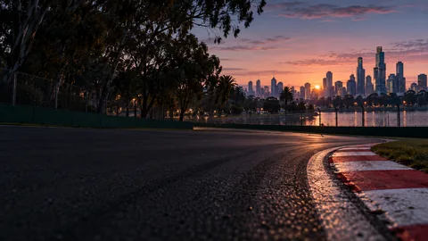 | **🇨🇳 Shanghái** 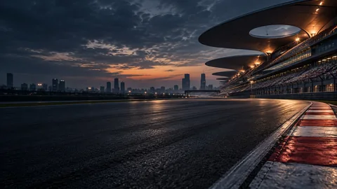 | **🇯🇵 Suzuka** 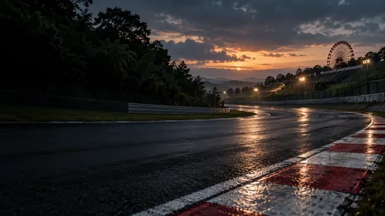 |
| **🇧🇭 Sakhir** 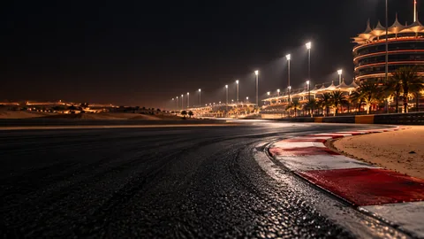 | **🇸🇦 Jeddah** 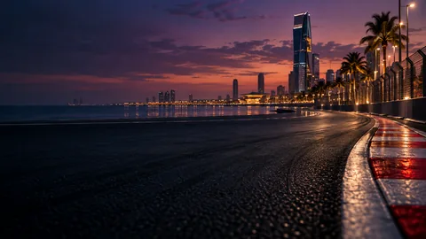 | **🇺🇸 Miami** 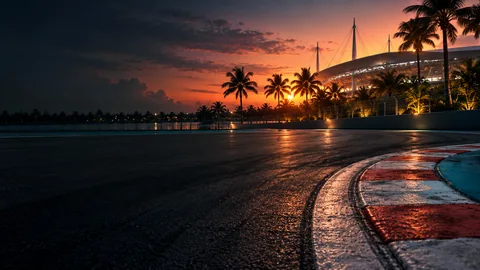 |
| **🇮🇹 Imola** 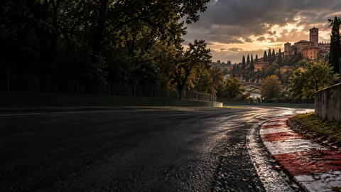 | **🇲🇨 Mónaco** 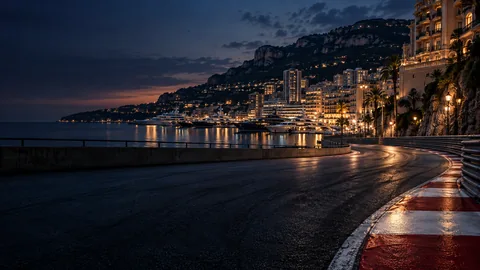 | **🇪🇸 Barcelona** 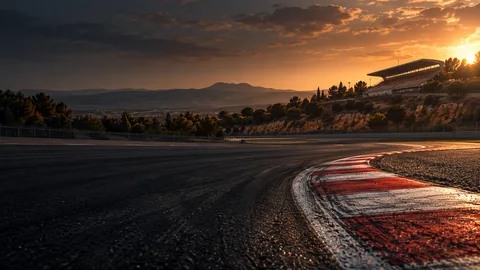 |
| **🇨🇦 Montreal** 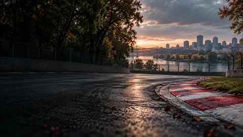 | **🇦🇹 Red Bull Ring** 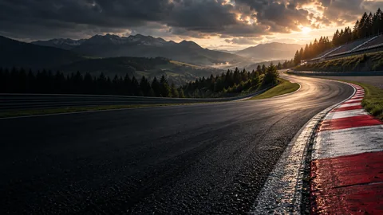 | **🇬🇧 Silverstone** 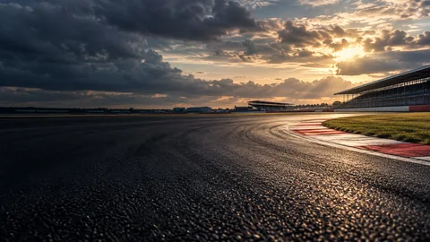 |
| **🇧🇪 Spa-Francorchamps** 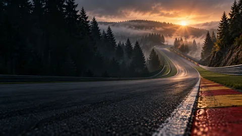 | **🇭🇺 Hungaroring** 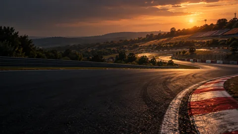 | **🇳🇱 Zandvoort** 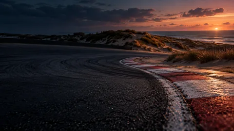 |
| **🇮🇹 Monza** 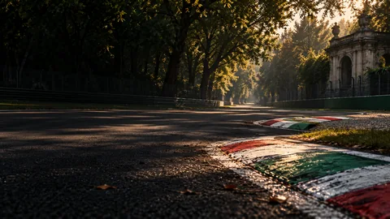 | **🇦🇿 Bakú** 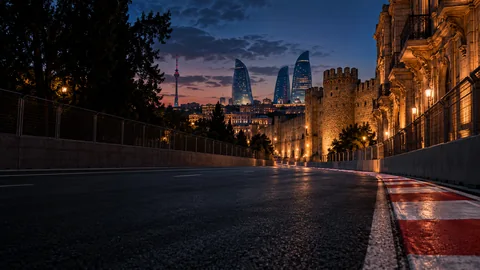 | **🇸🇬 Marina Bay** 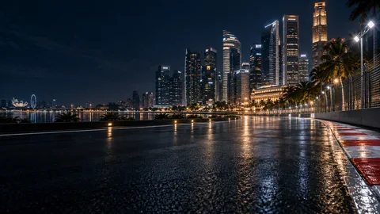 |
| **🇺🇸 Austin** 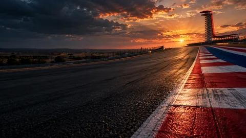 | **🇲🇽 Ciudad de México** 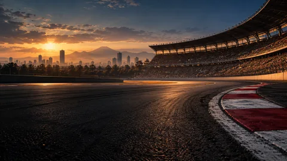 | **🇧🇷 Interlagos** 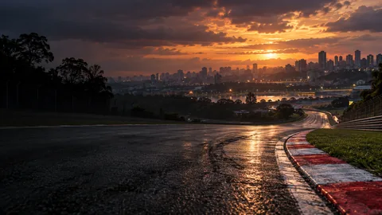 |
| **🇺🇸 Las Vegas** 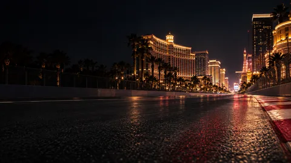 | **🇶🇦 Lusail** 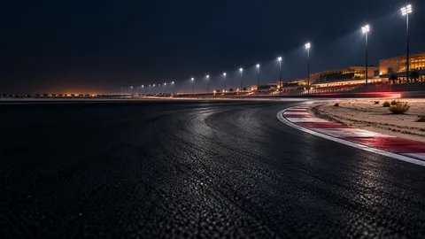 | **🇦🇪 Yas Marina** 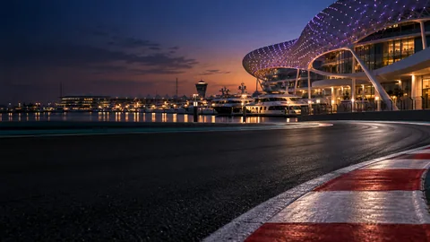 |
