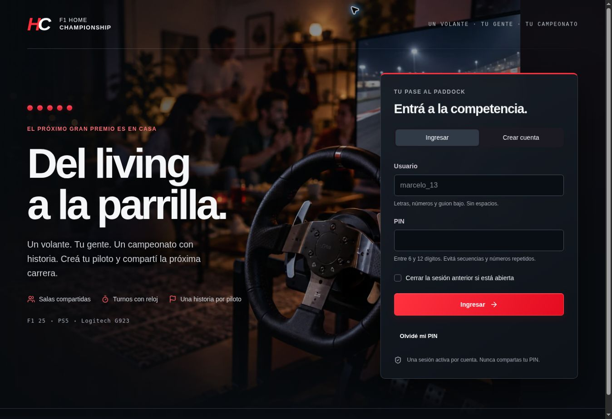
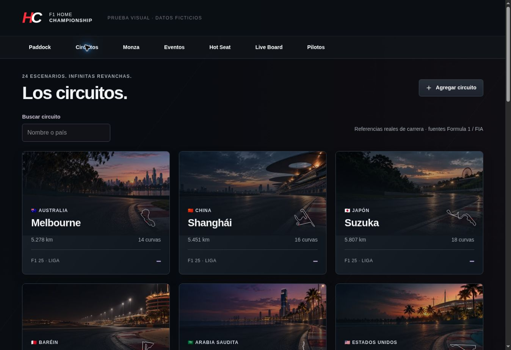
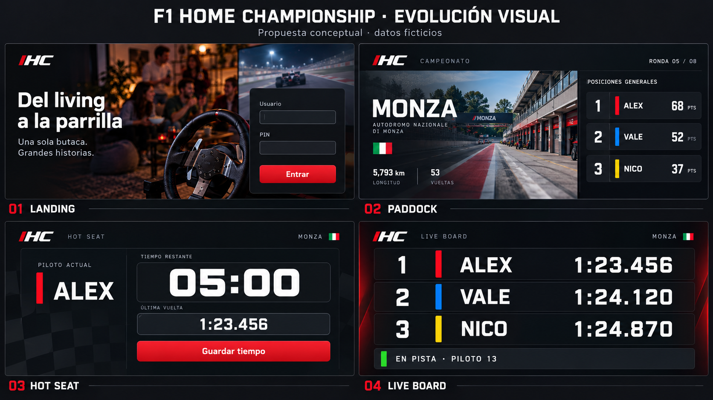

# F1 Home Championship

**Un volante. Una liga. Todos conectados.**

Una aplicación creada para organizar campeonatos de F1 25 entre familia y amigos, con una PS5, un solo volante y pilotos que compiten por turnos.

[Entrar a la aplicación](https://f1-home-championship.arielmarcelogomez7.chatgpt.site)

## El campeonato empieza en casa

Cada participante tiene un perfil y una historia. Una reunión deja resultados, puntos y récords; las siguientes continúan esa misma liga.

- Salas compartidas, registro con usuario y PIN y admisión por el anfitrión.
- Pilotos permanentes, temporadas, campeonatos y siete modalidades de competición.
- Hot Seat, carga rápida de vueltas y confirmación de dirección de carrera.
- Cronómetro opcional por turno, igual para todos, y tablero para TV.
- Clasificaciones, estadísticas, enfrentamientos y evolución de récords.
- Récords del videojuego separados de las referencias reales de Formula 1.
- Datos persistentes, exportación, recuperación y auditoría.

La app acompaña la competencia presencial. Los tiempos se registran y verifican manualmente a partir de la PS5.

## La experiencia visual

**Del living a la parrilla** ya forma parte de la aplicación. Una landing cinematográfica, superficies de competición legibles y una colección de **24 imágenes originales**, una por circuito.

Cada pista tiene su atmósfera en el paddock, la ficha del circuito, las fechas y la preparación de un evento. El cronómetro y las clasificaciones conservan fondos opacos para que las milésimas sean protagonistas.

[Ver los 24 escenarios](GALLERY.md) · [Dirección visual](VISUAL_DIRECTION.md)

Las escenas son interpretaciones artísticas, no fotografías verificadas ni mapas exactos. Los trazados y récords deportivos se muestran por separado en la app.

El storyboard que dio origen al diseño

Antecedente conceptual con datos ficticios. La implementación conserva los controles y funcionalidades reales de la aplicación.

## Sobre este repositorio

Este espacio es la presentación pública del proyecto. El código completo y la documentación de implementación se mantienen en un repositorio privado. No contiene datos de salas, usuarios, PIN ni respaldos deportivos.

El desarrollo utiliza React y TypeScript, una base relacional persistente y almacenamiento de archivos. La versión funcional pasó 56 pruebas de dominio/persistencia y 15 verificaciones de integración multiusuario.

**Creado por [Marcelo Gómez](https://github.com/sinergiaestudio)**.

Proyecto independiente, sin afiliación con Formula 1, FIA, EA Sports, PlayStation o Logitech. La presentación combina capturas de la interfaz implementada con imágenes conceptuales originales. Los ejemplos deportivos de las capturas son ficticios y aislados de las salas.
